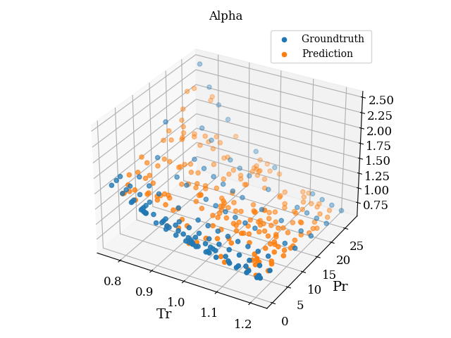
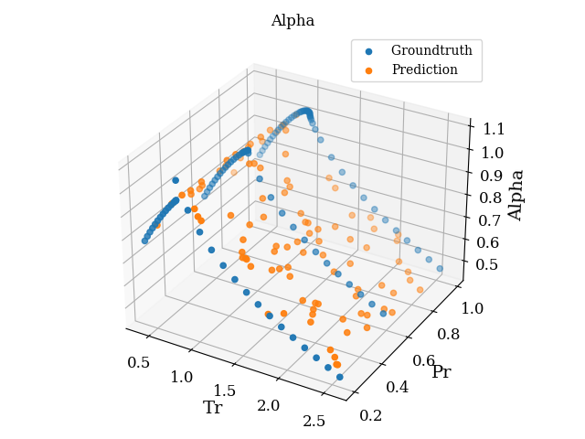
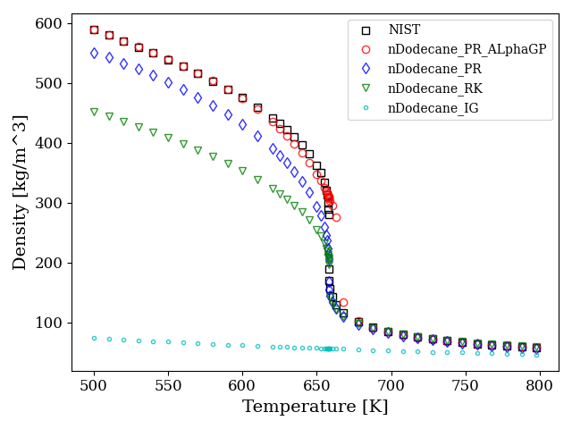
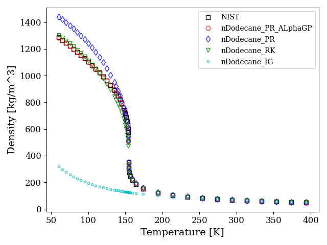
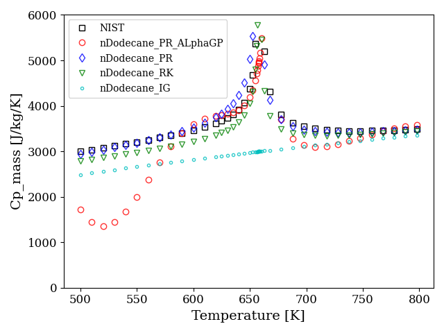
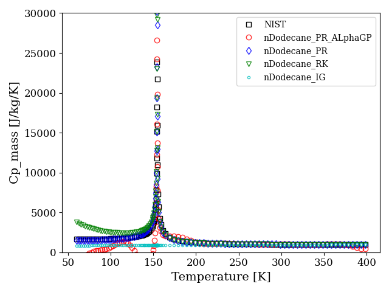
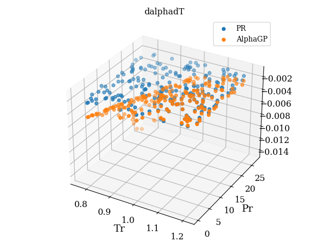
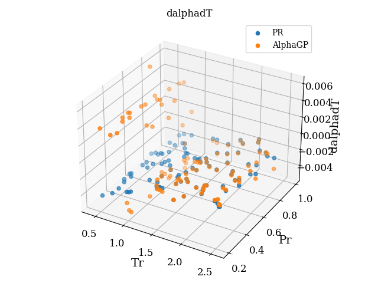
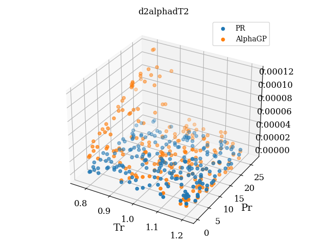
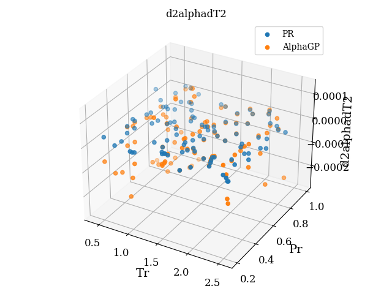

### Real Gas Effect in Reacting Flow

>  This code repository is used to evaluate the advantages of the proposed real gas equation of state (EoS)

[TOC]

#### 1. Code Environment

```shell
# Repo for cantera implementation
https://github.com/SuXY15/cantera
# Repo for this code
https://github.com/SuXY15/realGasEoS
# the file structure of this code
.
├── figs					# figures
├── Makefile				# Makefile for convenient  
├── mech					# mechanism files
├── README.md				# this document
├── README.pdf				# PDF version of this document
├── ref						# references, papers, etc
└── src						# source file directory
    ├── genAlapha.py			# generate alpha `groundtruth` data 
    ├── test_GPB.py				# test Gaussian Process with Basis Function, in Python
    ├── test_GP.py				# test Gaussian Process without Basis Function, in Python
    ├── test_PR.py				# test Peng-Robinson EoS with AlphaGP compensation, in Cantera
    ├── trainGP.m				# train Gaussian Process in Matlab
    └── utils.py				# useful tools and functions

```

```shell
# Cantera used in /opt/cantera_libs/cantera, one can modified code in `src` and build & install by
python3 /usr/bin/scons install
```

```shell
# The code in this repo can be run by
source /usr/local/bin/setup_cantera
python3 src/test_PR.py
```


#### 2. Basic Theory

##### 1.0 Generalized EoS

Helmholtz Free Energy: $ F \equiv U-TS =  A(T,v,n)$, where $U$ is the internal energy of the system, $T$ is the absolute temperature, $S$ is the entropy of the system.

+ 1st law of thermodynamics: $dU = \delta Q + \delta W$
+ 2nd law of thermodynamics: $\delta Q = TdS$

+ pressure work: $\delta W = -pdV$

Thus we have:

+ $ dU = TdS-pdV $

+ => $dU = d(TS) - SdT - pdV$
+ => $d(U-TS) = -SdT - pdV$
+ => $dF = -SdT - pdV$

Therefore,
$$
\begin{align*}
S &= -\left( \frac{\partial F}{\partial T} \right)_V \\
p &= -\left( \frac{\partial F}{\partial V} \right)_T \\
U &= F + TS = F - T \left( \frac{\partial F}{\partial T} \right)_V \\
H &= U + pV = F - T \left( \frac{\partial F}{\partial T} \right)_V - V \left( \frac{\partial F}{\partial V} \right)_T \\
C_p &= \left( \frac{\partial H}{\partial T} \right)_p = T \left[ \left( \frac{\partial^2 F}{\partial V\partial T} \right)_{V,T}^2 / \left( \frac{\partial^2 F}{\partial V^2} \right)_T - \left( \frac{\partial^2 F}{\partial T^2} \right)_V\right] \\
C_V &= \left( \frac{\partial U}{\partial T} \right)_V = -T\left( \frac{\partial^2 F}{\partial T^2} \right)_V
\end{align*}
$$

##### 1.1 Ideal Gas

$$
p = \frac{nRT}{V_m}
$$

where $V_m$ is the molar volume of the gas .

##### 1.2 Van der Waals (vdW) real gas equation _1783_

$$
p=\frac{RT}{V_m-b} - \frac{a}{V_m^2}
$$

where $b$ is the volume that is occupied by one mole of the molecules. vdW is a `cubic` type EoS.

##### 1.4 Redlich-Kwong (RK) real gas equation _1948_

$$
p = \frac{RT}{V_m - b} - \frac{a}{\sqrt{T} V_m (V_m+b)}
$$

where $a$ is a constant that corrects for attractive potential of molecules and $b$ is a constant that corrects for volume. The constants are different depending on which gas is being analyzed and can be calculated from the critical point data of corresponding gas:
$$
\begin{align*}
a &= \frac{1}{9(\sqrt[3]{2}-1)} \frac{R^2 T_c^{2.5}}{P_c} \\
b &= \frac{\sqrt[3]{2}-1}{3} \frac{RT_c}{P_c}
\end{align*}
$$
Where $T_c$ is the temperature at the critical point and $P_c$ is the pressure at the critical point. Noted that $a$ and $b$ are solved analytically from the thermodynamic criteria for the critical point:
$$
\left( \frac{\partial P}{\partial V} \right)_T = 0, \left( \frac{\partial^2 P}{\partial V^2} \right)_T = 0.
$$
For more details, please refer to original paper or wikipedia of Redlich Kwong equation of state.

##### 1.5 Soave modified Redlich-Kwong (SRK) real gas equation _1972_

In 1966, Barner noted that the acentric factor $\omega$ can be used to improve RK EoS. SRK is proposed by Soave as:
$$
p = \frac{RT}{V_m - b} - \frac{a \alpha}{V_m (V_m+b)}
$$
where
$$
\begin{align*}
\alpha &= \left [ 1+(0.480+1.574\omega-0.176\omega^2)(1-\sqrt{T_r}) \right]^2 \\

a &= \frac{1}{9(\sqrt[3]{2}-1)} \frac{R^2 T_c^{2}}{P_c} \\
b &= \frac{\sqrt[3]{2}-1}{3} \frac{RT_c}{P_c}
\end{align*}
$$
where $T_r=T/T_c$ is the reduced temperature of the compound. Noted that $\frac{1}{\sqrt{T}}$ term in RK is vanished and its effect is put into $a$ in SRK.

##### 1.6 Peng-Robinson (PR) real gas equation _1976_

The Peng-Robinson EoS further modified the RK EoS by modifying the attractive term, giving
$$
p = \frac{R T}{V_m-b} - \frac{a\alpha}{V_m(V_m+b) + b(V_m-b)}
$$
where
$$
\begin{align*}
\alpha &= \left [ 1+(0.37464+1.54226\omega-0.26992\omega^2)(1-\sqrt{T_r}) \right]^2 \\

a &= 0.457235 \frac{R^2 T_c^{2}}{P_c} \\
b &= 0.077796 \frac{RT_c}{P_c}
\end{align*}
$$

##### 1.7 PR-RK real gas equation _2005_

The limited accuracy of the two-parameter cubic EoS is caused by the inconsistency in the density dependence of its equation rather than the empirical nature of model constants $a$ and $b$. Many researchers proposed three parameters EoS.  In 2005, Cismondi and Mollerup have  proposed a three-parameter cubic EoS (hereafter RK-PR EoS) by introducing an additional parameter, $\delta_1$. 
$$
p = \frac{R T}{V_m-b} - \frac{a\alpha}{(V_m+\delta_1b)(V_m+\delta_2b)}
$$
where $\delta_2$ is not independent and $\delta_2 = (1-\delta_1)(1+\delta_1)$. And it will degenerate to SRK when $\delta_1=1, \delta_2=0$; and degenerate to PR when  $\delta_1 = 1+\sqrt2, \delta_2 = 1-\sqrt2 $.

##### 1.8 Mixture properties

When handling mixture, to obtain the aggregate parameters $a_m$, $b_m$ of the cubic EoS, mixing rules from the van der Waals one-fluid theory is applied:
$$
\begin{align*}
a_m &= \sum_i^{N_s} \sum_j^{N_s} X_i X_j a_{ij} \\
b_m &= \sum_i^{N_s} X_i b_i
\end{align*}
$$
where $X_i$ is the mole fraction of the $i^{th}$ components of the mixture,  $X_j$ is the mole fraction of the $j^{th}$ components of the mixture. Besides, $a_{ij}$ is the attractive term between a molecule of species $i$ and species $j$, which is usually calculated by $a_{ij} = (a_i a_j)^{1/2}$  or  $a_{ij}=(a_i a_j)^{1/2}(1-\delta_{ij})$.  $\delta_{ij}$ is an empirically determined binary interaction coefficient characterizing the binary formed by component i and component j.

The mixture properties $(a\alpha)_m$ is similarly:
$$
(a\alpha)_m = \sum_{i=1}^N \sum_{j=1}^N X_iX_j (a_{ij}\alpha_{ij})
$$

$$
(a_{ij}\alpha_{ij}) = \sqrt{a_i a_j \alpha_i \alpha_j}
$$


#### 2. The calibration model of alpha

The $\alpha$ is previously calculated by Sovae-type functions like

+ In SRK: $\alpha = \left [ 1+(0.480+1.574\omega-0.176\omega^2)(1-\sqrt{T_r}) \right]^2$
+ In PR: $\alpha = \left [ 1+(0.37464+1.54226\omega-0.26992\omega^2)(1-\sqrt{T_r}) \right]^2 $

But those are empirical approximations and would lead to notable effects in particular thermodynamically sensitive simulations. Here **a Gaussian Process (GP) based semi-parametric method** is used to utilize the information of experimental data as most as possible.

##### 2.1 The GP model

Here we're trying to fit a function that can map the inputs including $T_r$ to the ouput $\alpha$. Using the concept of Gaussian Process (GP) model, given the observations $(\boldsymbol X,y)$, when applying GP to predict the target $y_*$ at new input $\boldsymbol X_*$, one have
$$
\begin{align*}
\mu(y_*) & = \boldsymbol K_*^T (\boldsymbol K+\sigma^2_n\boldsymbol I)^{-1} y \\
\sigma^2(y_*) &= \boldsymbol K_{**} -\boldsymbol K_*^T (\boldsymbol K+\sigma^2_n\boldsymbol I)^{-1}\boldsymbol K_*
\end{align*}
$$
where $\sigma^2_n$ is the covariance of estimated Gaussian noise from observed data $(\boldsymbol X,y)$, $\boldsymbol K$ related terms are the covariance matrices as
$$
\begin{align*}
\boldsymbol K  &= cov(\boldsymbol X, \boldsymbol X) \\
\boldsymbol K_* &= cov(\boldsymbol X, \boldsymbol X_*) \\
\boldsymbol K_{**} &= cov(\boldsymbol X_*, \boldsymbol X_*) 
\end{align*}
$$

##### 2.2 Kernel functions

The covariance are usually obtained via kernel functions, which are very important for GP's data training. The most famous ones are:

+ Squared exponential (or say Radial Basis Function, RBF):
  $$
  cov(x_i, x_j) = \sigma_F^2 \exp(-\frac{d(x_i,x_j)^2}{2\gamma^2})
  $$
  where $d(x_i,x_j)$ is the Euclidean distance of $x_i$ and $x_j$,  $l$ is the length scale of kernel size.

+ Matern:
  $$
  k(x_i, x_j) = \frac{1}{\Gamma(\nu)2^{\nu-1}}\Bigg(\frac{\sqrt{2\nu}}{l} d(x_i , x_j )\Bigg)^\nu K_\nu\Bigg(\frac{\sqrt{2\nu}}{l} d(x_i , x_j )\Bigg),
  $$
  where $\Gamma$ is the Gamma function, $K_\nu$ is the modified Bessel function of order $\nu$.

##### 2.3 Basis functions

The basis function provides an important ability to model the mean of $y$ to zero.
$$
y(\boldsymbol x) = f(\boldsymbol x; \boldsymbol \theta) + b_{\boldsymbol \theta}(\boldsymbol x) + \epsilon
$$
where $\epsilon$ is the (Gaussian) stochastic error in the database, $f(\boldsymbol x; \boldsymbol \theta)$  is a basis function that can model $y(\boldsymbol x)$ as much as possible, and $b_{\boldsymbol \theta}(\boldsymbol x) $ is the bias term that can compensate the error between $f(\boldsymbol x; \boldsymbol \theta)$ and $y(\boldsymbol x)$.

To solve this optimization problem, let $f(\boldsymbol x; \boldsymbol \theta) = \theta_3 x_2 + \theta_2 x_1 + \theta_1 $ as a linear combination of the input variables $\boldsymbol x$, where the input variable are $\boldsymbol x=[x_1, x_2]$, $x_1$ and $x_2$ are the input from each dimension; and $\boldsymbol \theta = [\theta_1, \theta_2, \theta_3]$ are corresponding parameters in the linear combination function $f$.

The corresponding kernel function then be formed as:
$$
k(x_i,x_j) = k0(x_i,x_j) - h_\theta(x_i)^T \boldsymbol H_\theta h_\theta(x_j)
$$
where $h_\theta(x)$ is the 1st order global sensitivity obtained from:
$$
h_\theta(x) = \int_\boldsymbol X \nabla_\theta f (\xi) k_0(x,\xi)d\xi
$$
the 2nd order global sensitivity, i.e., Hessian matrix is
$$
\boldsymbol H_\theta = \int_\boldsymbol X \int_\boldsymbol X \left (\nabla_\theta f(\xi)\right) \left (\nabla_\theta f(\zeta)\right)^T k_0( \xi, \zeta) d \xi d \zeta
$$
The parameter gradient of $f$ shows 
$$
\nabla_\theta f (\boldsymbol x) = \frac{\partial }{\partial \boldsymbol \theta}f(\boldsymbol x; \boldsymbol \theta) = \left[ \begin{align*} 1 \\ x_1 \\ x_2 \end{align*} \right]
$$
The matrix constructed by gradients' outer product of randomly samples $ \xi, \zeta$
$$
\left (\nabla_\theta f(\boldsymbol \xi)\right) \left (\nabla_\theta f(\boldsymbol \zeta)\right)^T = \left[ \begin{matrix} 1 \\ \xi_1 \\ \xi_2 \end{matrix} \right] \left[ \begin{matrix} 1 & \zeta_1 & \zeta_2 \end{matrix} \right] = \left[ \begin{matrix} 1 & \zeta_1 & \zeta_2 \\ \xi_1 & \xi_1\zeta_1 & \xi_1\zeta_2 \\ \xi_2 & \xi_2\zeta_1 & \xi_2\zeta_2 \end{matrix} \right]
$$
The kernel function $k_0$ is:
$$
k_0( \xi, \zeta) = \sigma_F^2\exp(-\sum_i\frac{(\xi_i-\zeta_i)^2}{2\gamma_i^2}) = \sigma_F^2\exp(-\frac{(\xi_1-\zeta_1)^2}{2\gamma_1^2})\exp(-\frac{(\xi_2-\zeta_2)^2}{2\gamma_2^2})
$$
where $\gamma_1, \gamma_2$ are the parameters of kernel function in dimension $x_1$ and $x_2$.

The corresponding distribution of the evaluated output $y_*$ at new  $x_*$ should be:
$$
\begin{align*}

\mu(y_*) & = f(x_*;\theta) + \boldsymbol K_*^T \left(\boldsymbol K+\frac{\sigma_n^2}{\nu} \boldsymbol I\right)^{-1} \left[y-f(\boldsymbol X;\theta)\right] \\
\sigma^2(y_*) &= \nu + \boldsymbol K_{**} - \nu\boldsymbol K_*^T \left(\boldsymbol K+\frac{\sigma_n^2}{\nu} \boldsymbol I\right)^{-1} \boldsymbol K_*

\end{align*}
$$
where $\nu$ is a measurement of possible noises,  its maximum likelihood estimation (MLE)  $\hat \nu$ is
$$
\hat \nu = \frac{1}{N} [y-f(\boldsymbol X;\theta)]^T (\boldsymbol K+g\boldsymbol I)^{-1} [y-f(\boldsymbol X;\theta)]
$$
where $g$ is the original possible noise level, which still should be estimated by optimization program.


##### 2.4 Thermodynamic Properties

By setting at least two thermo states like $ p,T,\rho$ , one can calculate all the related thermodynamic properties of given mixture. Where pressure $p$ and temperature $T$ can be obtained explicitly from the equation of state (EoS). Density can be obtained by first getting $V_m$ via solving the cubic function:
$$
p = \frac{R T}{V-b} - \frac{a\alpha}{V^2+2Vb-b^2}
$$
Other related thermodynamic properties can be calculated via:
$$
\begin{align*}
C_v &= \left(\frac{\partial H}{\partial T}\right)_V - V \left(\frac{\partial p}{\partial T}\right) \\
C_p &= C_v - T \left(\frac{\partial p}{\partial T} \right)^2 /\frac{\partial p}{\partial V} \\
s(T,p) &= \\
e(T,p) &= \\
h(T,p) &=
\end{align*}
$$
where the corresponding partial derivatives are:
$$
\begin{align*}
\left(\frac{\partial H}{\partial T}\right)_V &= C_{p,0} + V\frac{\partial p}{\partial T} - R + \frac{1}{2\sqrt2 b}\log(\frac{V+b}{V-b}) T \frac{\partial^2 (a\alpha)_m}{\partial T^2}
\\
\frac{\partial p}{\partial T} &= \frac{R}{V-b} - \frac{\partial (a\alpha)_m}{\partial T} \frac{1}{V^2+2Vb-b^2} \\
\frac{\partial p}{\partial V} &= -\frac{RT}{(V-b)^2} + 2\frac{(a\alpha)_m(V+b)}{V^2+2Vb-b^2} \\

\end{align*}
$$
The alpha related properties are:
$$
\begin{align*}
\frac{\partial (a\alpha)_m}{\partial T} &= \sum_{i=1}^N \sum_{j=1}^N X_iX_j \frac{\partial (a_{ij} \alpha_{ij})}{\partial T} \\
\frac{\partial^2 (a\alpha)_m}{\partial T^2} &= \sum_{i=1}^N \sum_{j=1}^N X_iX_j \frac{\partial^2 (a_{ij} \alpha_{ij})}{\partial T^2}
\end{align*}
$$
where the derivatives of  $(a_{ij} \alpha_{ij})$ are:
$$
\begin{align*}
\frac{\partial (a_{ij} \alpha_{ij})}{\partial T} &= \sqrt{a_ia_j} \frac{\partial \sqrt{\alpha_i\alpha_j}}{\partial T} = \frac{1}{2}\sqrt{a_ia_j\alpha_i\alpha_j} \left( \frac{1}{\alpha_i}\frac{\partial \alpha_i}{\partial T} + \frac{1}{\alpha_j}\frac{\partial \alpha_j}{\partial T} \right) \\
\frac{\partial^2 (a_{ij} \alpha_{ij})}{\partial T^2} &= \frac{1}{2}\sqrt{a_ia_j\alpha_i\alpha_j} \left[ \frac{1}{\alpha_i}\frac{\partial^2 \alpha_i}{\partial T} + \frac{1}{\alpha_j}\frac{\partial^2 \alpha_j}{\partial T} + \frac{2}{\alpha_i\alpha_j} \frac{\partial \alpha_i}{\partial T} \frac{\partial \alpha_j}{\partial T} - \frac{1}{2}\left( \frac{1}{\alpha_i}\frac{\partial \alpha_i}{\partial T} + \frac{1}{\alpha_j}\frac{\partial \alpha_j}{\partial T}  \right)^2  \right]
\end{align*}
$$
Finally, we only need to get $\frac{\partial \alpha}{\partial T} $ and $\frac{\partial^2 \alpha}{\partial T^2} $. 

+ For the original Peng-Robinson EoS framwork, 

$$
\alpha = \left[1+\kappa\left(1-\sqrt{T/T_c}\right)\right]^2
$$

Therefore,
$$
\begin{align*}
\frac{\partial \alpha}{\partial T}  &= \frac{\kappa^2}{T_c} - (\kappa^2+\kappa)\frac{1}{\sqrt{Tc}} T^{-1/2}\\
\frac{\partial^2 \alpha}{\partial T^2} &= \frac{1}{2}(\kappa^2+\kappa) \frac{1}{\sqrt{T_c}} T^{-3/2}
\end{align*}
$$

+ For the Gaussian Process's framework without basis function, we have:

$$
\alpha(x_*) = \mu(\alpha_*)  = \boldsymbol K_*^T (\boldsymbol K+\sigma^2_n\boldsymbol I)^{-1} \alpha_{obs} \\
$$

where $\alpha_{obs}$ is the given observed data of $\alpha$ from NIST or experimental data at specific temperatures and pressures. The right hand side (RHS) term $(\boldsymbol K+\sigma^2_n\boldsymbol I)^{-1} \alpha_{obs}$ is known during the prediction of $\alpha(x_*)$, hence is denoted as $\boldsymbol m$ here. For a single new evaluation point $x_*=(T_{r,*}, P_{r,*})$ , the $\boldsymbol K_*$ is matrix of dimension $N\times 1$, so:
$$
\alpha = \sum_{i=1}^{N} k_{*,i} m_i
$$
where 
$$
k_{*,i} = \sigma_F^2\exp(-\frac{(T_{r,*}-T_{r,i})^2}{2\gamma^2_T} - \frac{(P_{r,*}-P_{r,i})^2}{2\gamma^2_T})
$$
Thus,
$$
\begin{align*}
\frac{\partial \alpha}{\partial T} &= \sum_{i=1}^N m_i \frac{\partial k_{*,i}}{\partial T} = \sum_{i=1}^Nm_i \left(-\frac{1}{T_c}\frac{T_{r,*}-T_{r,i}}{\gamma_T^2} \right) k_{*,i} \\

\frac{\partial^2 \alpha}{\partial T^2} &= \sum_{i=1}^N m_i \frac{\partial^2 k_{*,i}}{\partial T^2} = \sum_{i=1}^Nm_i \left( \frac{1}{T_c^2}\frac{(T_{r,*}-T_{r,i})^2}{\gamma_T^4} - \frac{1}{T_c^2}\frac{1}{\gamma_T^2} \right)k_{*,i}
\end{align*}
$$

+ For the Gaussian Process's framework with basis function, we have:

$$
\alpha(x_*) = \mu(\alpha_*) = f(x_*;\theta) + \boldsymbol K_*^T \left(\boldsymbol K+\frac{\sigma_n^2}{\nu} \boldsymbol I\right)^{-1} \left[y-f(\boldsymbol X;\theta)\right]
$$

Similarly, one can define the known RHS terms as $\boldsymbol m= \left(\boldsymbol K+\frac{\sigma_n^2}{\nu} \boldsymbol I\right)^{-1} \left[y-f(\boldsymbol X;\theta)\right]$, and $\alpha =  f(x_*;\theta) + \sum_{i=1}^{N} k_{*,i} m_i$, with
$$
k_{*,i} = k0(x_*,x_i) - h_\theta(x_*)^T \boldsymbol H_\theta h_\theta(x_i)
$$
where
$$
\begin{align*}
h_\theta(x_*) &= \int_\boldsymbol X \nabla_\theta f (\xi) k_0(x_*,\xi)d\xi \\
h_\theta(x_i) &= \int_\boldsymbol X \nabla_\theta f (\xi) k_0(x_i,\xi)d\xi
\end{align*}
$$
so $\boldsymbol H_\theta h_\theta(x_i)$ is a known term and is hereby  denoted as $g_\theta(x_i)=[g_{i,1}, g_{i,2}, g_{i,3}]$. Therefore,
$$
k_{*,i} = k0(x_*,x_i) - h_\theta(x_*)^T g_\theta(x_i) = k0(x_*,x_i)  - g_{i,1} \sum_{j=1}^N k0(x_*,x_j) - g_{i,2} \sum_{j=1}^N x_{j,1} k0(x_*,x_j) - g_{i,3} \sum_{j=1}^N x_{j,2} k0(x_*,x_j)
$$

$$
\begin{align*}
\frac{\partial k_{*,i}}{\partial T} &= \frac{\partial k0(x_*,x_i)}{\partial T} - g_{i,1} \sum_{j=1}^N \frac{\partial k0(x_*,x_j)}{\partial T} - g_{i,2} \sum_{j=1}^N \left[ x_{j,1} \frac{\partial k0(x_*,x_j)}{\partial T} + \frac{\partial x_{j,1}}{\partial T}k0(x_*,x_j) \right]-  g_{i,3} \sum_{j=1}^N x_{j,2} \frac{\partial k0(x_*,x_j)}{\partial T}\\
\frac{\partial^2 k_{*,i}}{\partial T^2} &= \frac{\partial^2 k0(x_*,x_i)}{\partial T^2} - g_{i,1} \sum_{j=1}^N \frac{\partial^2 k0(x_*,x_j)}{\partial T^2} - g_{i,2} \sum_{j=1}^N \left[ x_{j,1} \frac{\partial^2 k0(x_*,x_j)}{\partial T^2} + 2\frac{\partial x_{j,1}}{\partial T}\frac{\partial k0(x_*,x_j)}{\partial T} \right]-  g_{i,3} \sum_{j=1}^N x_{j,2} \frac{\partial^2 k0(x_*,x_j)}{\partial T^2}
\end{align*}
$$

And finally:
$$
\begin{align*}
\frac{\partial \alpha}{\partial T} &= \frac{\partial f}{\partial T} + \sum_{i=1}^N m_i \frac{\partial k_{*,i}}{\partial T} \\
\frac{\partial^2 \alpha}{\partial T^2} &=  \frac{\partial^2 f}{\partial T^2} +  \sum_{i=1}^N m_i \frac{\partial^2 k_{*,i}}{\partial T^2} 
\end{align*}
$$

##### 2.5 Implementation

Reading Alpha related files:

```c++
setSpeciesCoeffs(species, a, b, w)
	-> readAlphaPara(filename, BasisTheta, KernelGamma, KernelSigma)
		-> readCSV(filename, para, nrow, ncol)
	-> readAlphaData(filename, AlphaX, Alphay)
		-> readCSV(filename, para, nrow, ncol)
```

The call stack for calculating density

```c++
ThermoPhase::setState_TP(t, p)
	-> PengRobinsonAlphaGP::setTemperature(t)
		-> Phase::setTemperature(t)
		-> _updateReferenceStateThermo();
		-> updateMixingExpressions();
			-> mixAlpha()
			-> calculateAB(a, b, aAlpha_mix)
	-> PengRobinsonAlphaGP::setPressure(p)
		-> densityCalc(t, p, FLUID_PHASE, rhoNow)
			-> updateAlpha(t, p)
			-> setTemperature(t)
			-> solveCubic(t, p, a, b, aAlpha_mix, Vroot)
```

##### 2.6 Validation

+ The training data of $\alpha$ along with $T_r, P_r$ is generated via quering in NIST database. For a given $T,P$, one can get $V$ in NIST database and $\alpha$ is obtained using PR equation of state, in `genAlpha.py`.

+ The training of Gaussian Process is accomplished by the Matlab code `trainGP.m`, using `fitrgp` function in Matlab.

+ Validation in Python code `test_GP.py` of Gaussian Process, where the left panel is C12 and the right panel shows the result of oxygen.

   

+ Validation in Cantera implementation. Below is the comparison of **density $\rho$**, where the left panel is C12 and the right panel shows the result of oxygen.

 

+ Validation in Cantera implementation. Below is the comparison of **heat capacity $C_p$**, where the left panel is C12 and the right panel shows the result of oxygen.

 

+ While $C_p$ is influenced by the 1st and 2nd order gradients of $\alpha$ along with temperature $T$, the gradients are plotted here compared with PR's gradients. The first order gradients of C12 (left) and oxygen (right):

 

​		The second order gradients of C12 (left) and oxygen (right):

 

+ From the  view of fitting:

  + The PR EoS is an approximation of `real` EoS, and $\alpha(T_r, P_r)$ is a modeled empirical term in PR EoS.
    $$
    p = \frac{R T}{V-b} - \frac{a\alpha}{V^2+2Vb-b^2}
    $$

  + And the heat capacity is a function of $C_p=f(p,T,\alpha,\frac{\partial \alpha}{\partial T}, \frac{\partial^2 \alpha}{\partial T^2})$ 
    $$
    \begin{align*}
    C_p &= \left(\frac{\partial H}{\partial T}\right)_V - V \left(\frac{\partial p}{\partial T}\right) - T \left(\frac{\partial p}{\partial T} \right)^2 /\frac{\partial p}{\partial V} \\
    \left(\frac{\partial H}{\partial T}\right)_V &= C_{p,0} + V\frac{\partial p}{\partial T} - R + \frac{1}{2\sqrt2 b}\log(\frac{V+b}{V-b}) T \frac{\partial^2 (a\alpha)_m}{\partial T^2} \\
    \frac{\partial p}{\partial T} &= \frac{R}{V-b} - \frac{\partial (a\alpha)_m}{\partial T} \frac{1}{V^2+2Vb-b^2} \\
    \frac{\partial p}{\partial V} &= -\frac{RT}{(V-b)^2} + 2\frac{(a\alpha)_m(V+b)}{V^2+2Vb-b^2} \\
    
    \end{align*}
    $$
  
  + Therefore, using $\alpha$ from $p,T,V$ 
    $$
    \alpha = \frac{V^2+2Vb-b^2}{a} \left(\frac{R T}{V-b} - p \right)
    $$
    would only improve the accuracy of $V$ or $\rho$, but could not improve the performance of $C_p$.


#### 3. Appendix

##### 3.1 The equation of heat capacity $C_p$ 

Using the chain rule from Table 5, Page 4 of [Partial derivatives of thermodynamic state properties for dynamic simulation](https://link.springer.com/article/10.1007/s12665-013-2394-z),
$$
\begin{align*}
C_p = \left( \frac{\partial H}{\partial T} \right)_p = \left( \frac{\partial H}{\partial T} \right)_V - \left( \frac{\partial H}{\partial V} \right)_T \left( \frac{\partial p}{\partial T} \right)_V \left( \frac{\partial p}{\partial V} \right)_T^{-1} 
\end{align*}
$$
where
$$
\begin{align*}
\left( \frac{\partial H}{\partial T} \right)_V
	&= \left( \frac{\partial F}{\partial T} \right)_V - \left( \frac{\partial F}{\partial T} \right)_V - T \left( \frac{\partial^2 F}{\partial T^2} \right)_V  - V \left( \frac{\partial^2 F}{\partial V\partial T} \right)_{T,V} \\ 
	&= - T \left( \frac{\partial^2 F}{\partial T^2} \right)_V  - V \left( \frac{\partial^2 F}{\partial V\partial T} \right)_{T,V} \\

\left( \frac{\partial H}{\partial V} \right)_T
	&=  \left( \frac{\partial F}{\partial V} \right)_T - T \left( \frac{\partial^2 F}{\partial T\partial V} \right)_{V,T} - \left( \frac{\partial F}{\partial V} \right)_T - V \left( \frac{\partial^2 F}{\partial V^2} \right)_T \\
	&= - T \left( \frac{\partial^2 F}{\partial T\partial V} \right)_{V,T} - V \left( \frac{\partial^2 F}{\partial V^2} \right)_T \\

\left( \frac{\partial p}{\partial T} \right)_V 
	&= -\left( \frac{\partial^2 F}{\partial V\partial T} \right)_{T,V} \\

\left( \frac{\partial p}{\partial V} \right)_T 
	&= -\left( \frac{\partial^2 F}{\partial V^2} \right)_T
\end{align*}
$$
therefore,
$$
\begin{align*}
C_p 
&= \left( \frac{\partial H}{\partial T} \right)_V - \left( \frac{\partial H}{\partial V} \right)_T \left( \frac{\partial p}{\partial T} \right)_V \left( \frac{\partial p}{\partial V} \right)_T^{-1} \\
&= - T \left( \frac{\partial^2 F}{\partial T^2} \right)_V  - V \left( \frac{\partial^2 F}{\partial V\partial T} \right)_{T,V} + \left[ T \left( \frac{\partial^2 F}{\partial T\partial V} \right)_{V,T} + V \left( \frac{\partial^2 F}{\partial V^2} \right)_T \right]\left( \frac{\partial^2 F}{\partial V\partial T} \right)_{T,V}/\left( \frac{\partial^2 F}{\partial V^2} \right)_T \\
&= - T \left( \frac{\partial^2 F}{\partial T^2} \right)_V  +T \left( \frac{\partial^2 F}{\partial T\partial V} \right)_{V,T}  \left( \frac{\partial^2 F}{\partial V\partial T} \right)_{T,V}/\left( \frac{\partial^2 F}{\partial V^2} \right)_T \\
&= T \left[ \left( \frac{\partial^2 F}{\partial V\partial T} \right)_{V,T}^2 / \left( \frac{\partial^2 F}{\partial V^2} \right)_T - \left( \frac{\partial^2 F}{\partial T^2} \right)_V\right]
\end{align*}
$$


